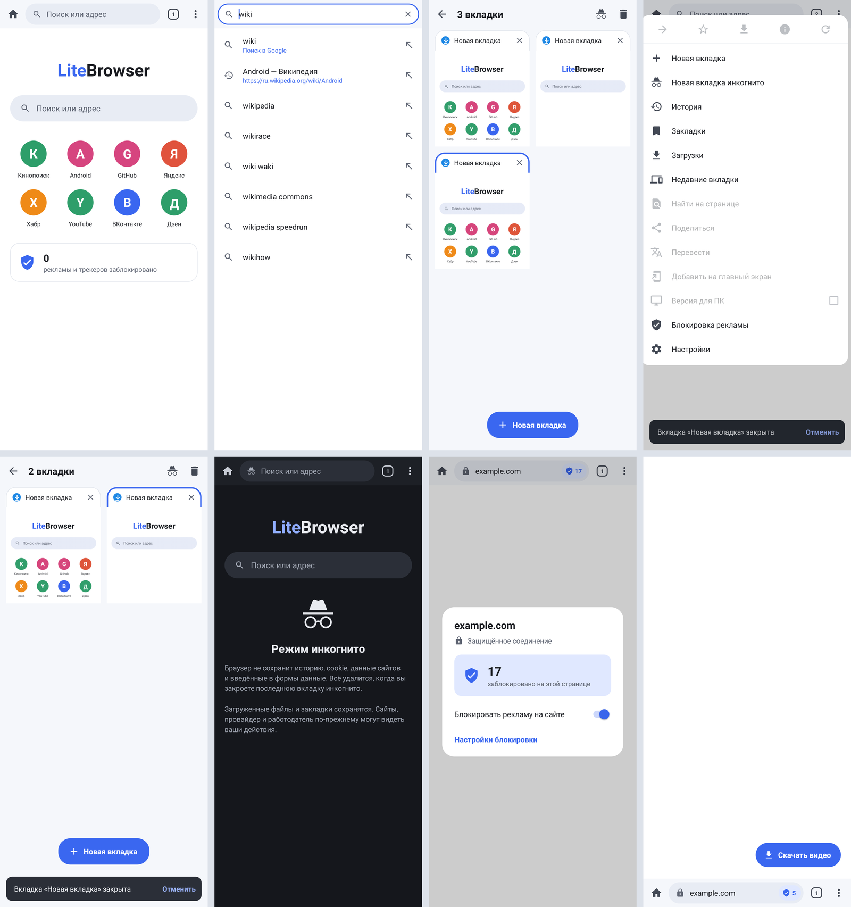

# Svetlo

**Svetlo** («светло») — лёгкий браузер для Android (APK ≈ 250 КБ) с мощной блокировкой рекламы и скачиванием видео.
Работает на системном WebView, без AndroidX и сторонних библиотек.



## Интерфейс

- Первый запуск: выбор поисковика, положения адресной строки, блокировки рекламы и тёмных сайтов,
  кнопка «Сделать браузером по умолчанию».
- Адресная строка с подсказками: история, закладки и подсказки поисковика (Google, Яндекс, DuckDuckGo, Bing).
- Вкладки с карточками-превью, фоновые вкладки, восстановление вкладок вместе с историей «Назад/Вперёд».
- Стартовая страница: частые сайты, ручное добавление ярлыков, поиск и счётчик заблокированной рекламы.
  Долгое нажатие на плитку убирает её с экрана.
- Меню с быстрыми действиями: вперёд, закладка, видео, информация о сайте, обновить.
- История и закладки с поиском, поиск по странице, версия для ПК, «Поделиться».
- Режим чтения (размер и начертание шрифта, светлая/сепия/тёмная тема), печать и сохранение в PDF.
- Картинка в картинке: видео на весь экран продолжает играть в окне, если выйти из приложения.
- Менеджер загрузок: прогресс и скорость, отмена, открыть, поделиться, удалить.
- Светлая и тёмная тема (по системе), затемнение сайтов, адресная строка сверху или снизу.
- Долгое нажатие на ссылку/картинку: открыть в новой/фоновой вкладке, скопировать, скачать.

## Жесты и анимации (как в Chrome)

- Свайп по адресной строке влево/вправо — переключение вкладок, соседняя вкладка «выезжает» за пальцем.
- Свайп вниз по адресной строке (вверх — если панель снизу) — список вкладок.
- Панель прячется при прокрутке вниз и появляется при прокрутке вверх.
- Потянуть страницу вниз от верха — обновить (индикатор с пружинящим ходом).
- Список вкладок открывается зумом страницы в карточку и закрывается зумом обратно.
- Карточку вкладки можно смахнуть в сторону, чтобы закрыть; «Отменить» возвращает вкладку со всей историей.
- Долгое нажатие на счётчик вкладок — закрыть вкладку / новая вкладка / инкогнито.
- Долгое нажатие на адрес — скопировать ссылку. При фокусе адресная строка расширяется,
  предлагает скопированную ссылку, недавние страницы и голосовой поиск.
- Меню раскрывается из угла, прогресс загрузки плавно заполняется и гаснет.

## Режим инкогнито

- Отдельное окно в тёмной теме. На Android 9+ работает в отдельном процессе со своим каталогом
  данных WebView: cookie, хранилище и кэш изолированы от обычных вкладок и удаляются при закрытии.
- История, вкладки и данные форм не сохраняются. На Android 7–8 cookie общие с обычными вкладками.

## Ещё

- Недавно закрытые вкладки, «Перевести» (Google Translate), «Добавить на главный экран».

## Блокировка рекламы

- Собственный движок фильтров, совместимый с AdBlock Plus / uBlock Origin:
  `||домен^`, маски `*` и `^`, якоря `|`, регулярные выражения, исключения `@@`, `$important`,
  `$third-party`, `$domain=`, типы ресурсов (`$script`, `$image`, `$subdocument`…), `$popup`, `$document`,
  `$elemhide`/`$generichide`, скрытие элементов `##` / `#@#` (общее и для отдельных сайтов).
- Списки по умолчанию: **EasyList + RuAdList**, **EasyPrivacy** (трекеры), **Peter Lowe** (встроен в APK).
  Дополнительно: AdGuard Русский, AdGuard Раздражители, любые свои списки по URL и свои правила.
- Списки скачиваются при первом запуске (~5 МБ) и обновляются раз в 4 дня.
- Блокировка всплывающих окон и переходов на рекламные сайты, пропуск рекламы в YouTube.
- Щит в адресной строке: сколько заблокировано на странице, отключение блокировки для сайта.

## Сайты

- Доступ к камере, микрофону и местоположению — по запросу сайта, с подтверждением.
- Понятная страница ошибки (нет интернета, сайт не найден, не отвечает) с кнопкой «Повторить».
- Предупреждение о недействительном сертификате, окно входа для сайтов с HTTP-авторизацией.
- Скачивание файлов, которые сайт создаёт сам (`blob:` и `data:`).

## Скачивание видео

- Кнопка «Видео» появляется, когда на странице найдено медиа; в панели можно открыть поток во внешнем плеере или сразу скачать его. Сегменты и превью отфильтровываются.
- Прямые файлы (mp4, webm, mkv, mp3…) скачиваются через системный загрузчик, имя файла — по заголовку страницы.
- HLS (`.m3u8`) и DASH (`.mpd`): выбор качества (720p, 1080p…) или «Авто», загрузка в 4 потока, AES-128,
  `EXT-X-MAP`/`EXT-X-BYTERANGE`. Несколько загрузок одновременно, у каждой своё уведомление
  со скоростью и кнопкой «Отмена»; по нажатию на готовое уведомление файл открывается.
- «Записать видео из плеера» — для YouTube и других сайтов, где видео идёт через MSE без ссылки на файл:
  страница перезагружается, и сохраняется всё, что загружает плеер (видео нужно досмотреть).
- Если звук в потоке идёт отдельной дорожкой, он сохраняется рядом отдельным файлом (склеить без ffmpeg нельзя).
- Файлы сохраняются в `Download/Svetlo`.

## Ограничения

- Видео с DRM (Netflix, SAMPLE-AES и т.п.) и прямые трансляции не скачиваются.
- Запись из плеера сохраняет только проигранное; при смене качества создаётся новая часть файла.
  Плееры во встроенных фреймах (iframe) не записываются.
- Процедурные фильтры (`:has-text`, `:has`, `:upward`, `:xpath`, `:matches-css`, `:matches-path`, `:remove()`, `:style()`, `#?#`, `#$#`) и скриптлеты (`##+js(...)`, `#%#//scriptlet(...)`) работают только для правил с доменом и из встроенного набора (set-constant, aopr/aopw, acs, nostif/nosiif, aeld, json-prune, ra/rc, nowoif, prevent-fetch/xhr, nano-stb и др.); `trusted-*`, `:matches-attr`, `:others`, HTML-фильтры `##^` не поддерживаются. Скриптлеты внедряются в самом начале загрузки страницы, но WebView не гарантирует, что раньше её скриптов, поэтому срабатывают не всегда.

## Сборка и тесты

Нужны JDK 17 и Android SDK 34.

```sh
./gradlew assembleRelease     # app/build/outputs/apk/release/app-release.apk
./gradlew testDebugUnitTest   # тесты движка фильтров, HLS-загрузчика и детектора видео
# Robolectric: скриншоты экранов → app/build/screenshots/ и тест скрытия панели
./gradlew testDebugUnitTest -Pscreenshots=true --tests '*ScreenshotTest*' --tests '*RobolectricTest*'
```

Бенчмарк на реальных списках запускается, если положить `.txt`-списки в `/tmp/filterlists`
(или указать `-Dfilterlists.dir`).

Release подписывается ключом из переменных окружения `SVETLO_*`, без них — debug-ключом.
Выпуск версий и настройка ключа описаны в [docs/RELEASE.md](docs/RELEASE.md).
GitHub Actions собирает APK как артефакт `LiteBrowser-apk` и хранит скриншоты интерфейса неделю в `Svetlo-interface-review`.
