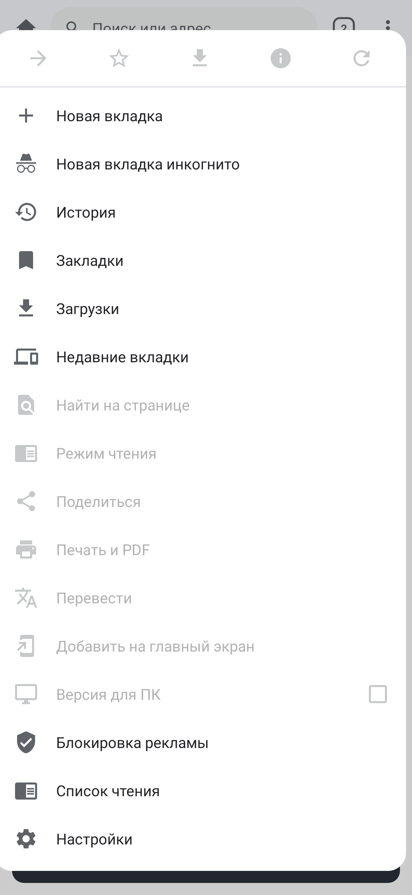
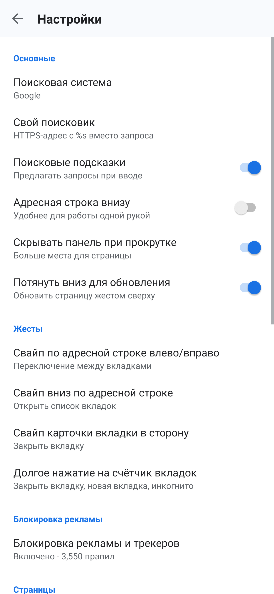
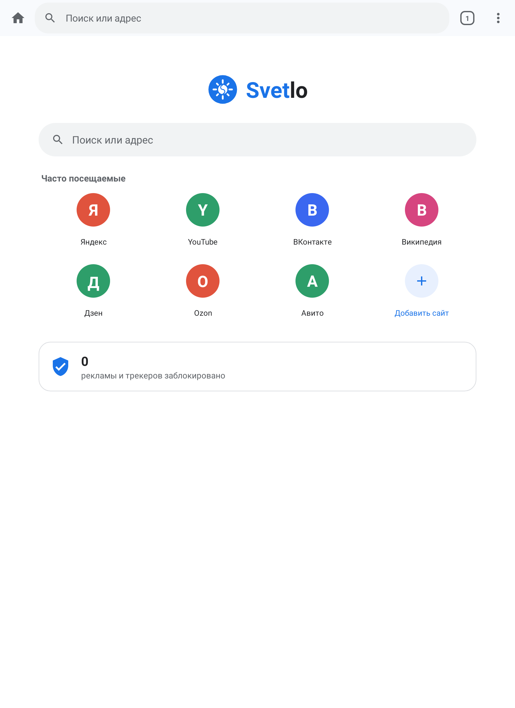
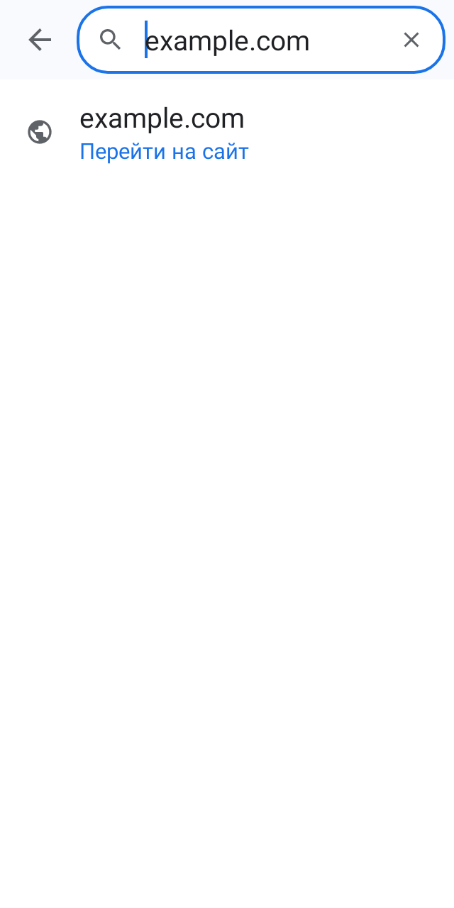
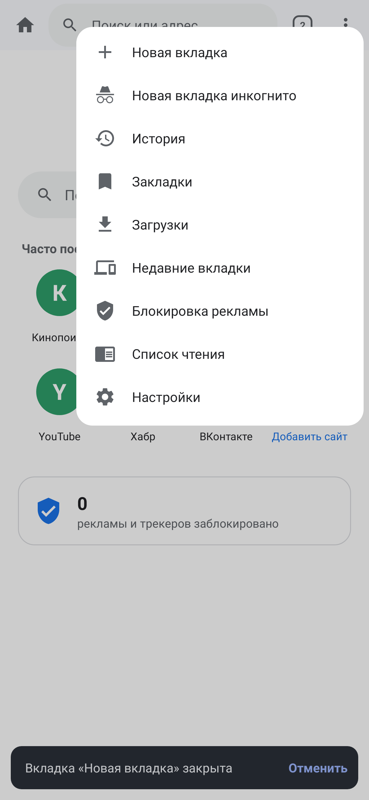
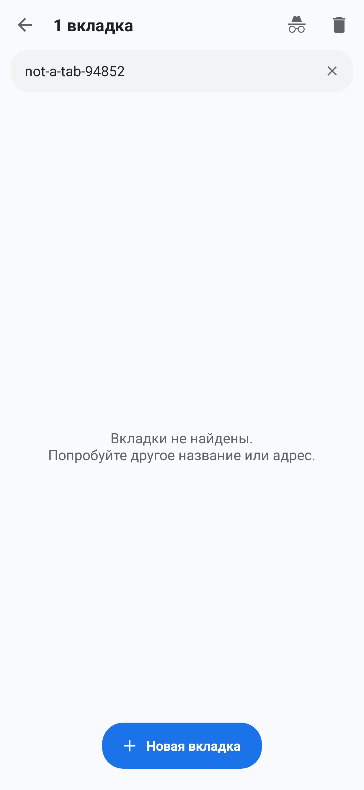
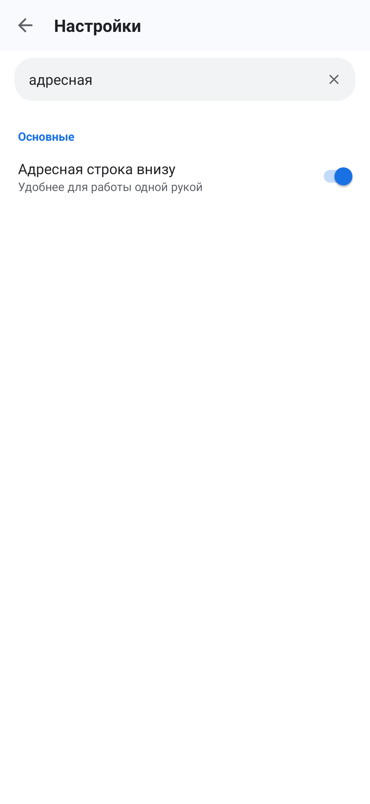
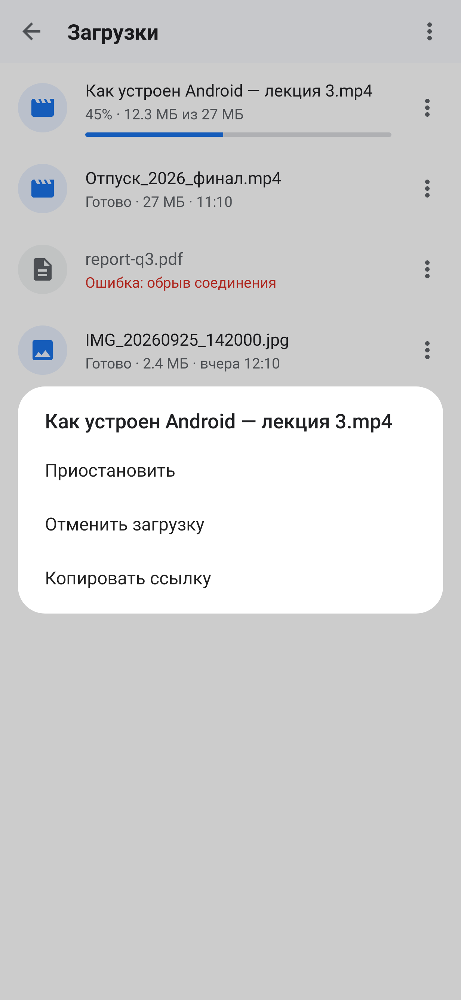
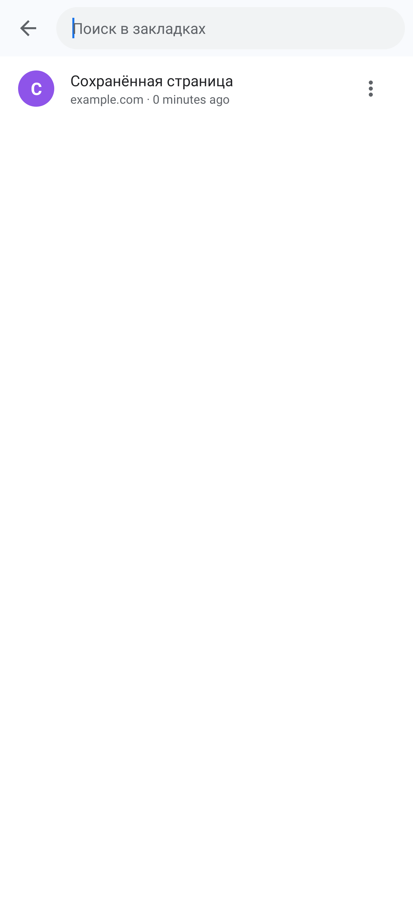
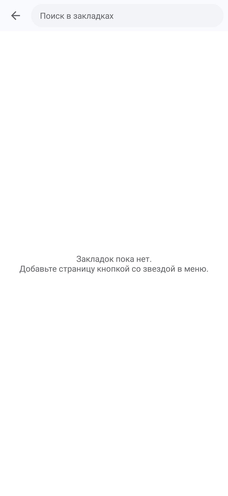

# Проверка интерфейса Svetlo 0.4.0-rc2

Проверка выполнена 30 сентября 2026 года по свежей отрисовке Android View через Robolectric Native Graphics и тестам сценариев. Это снимки приложения с тестовыми данными, а не макеты Chrome. Окна диалогов и меню наложены на снимок Activity тестовым инструментом. Проверены телефон 411 dp, узкий телефон 320 dp с увеличенным шрифтом, планшет 800 dp, светлая и тёмная темы.

## Основные находки до изменений

Меню новой вкладки занимало почти весь экран, хотя многие действия нельзя было выполнить. Большой блок справки о жестах отодвигал важные настройки. Кнопки панели и закрытия карточек имели зоны меньше 48 dp. Поиск вкладок не объяснял отсутствие результатов, а действия истории были доступны только долгим нажатием. Кнопка активной загрузки немедленно отменяла её.

## 1. Главная — исправлено

Сетка ярлыков использует три колонки на узком экране и при увеличенном шрифте; подписи допускают две строки. На планшете содержимое ограничено центральной колонкой 720 dp. При смене ориентации обновляется компоновка. Крупный системный шрифт больше не требует помещать длинные подписи в одну строку.

## 2. Ввод адреса — исправлено

Добавлена явная кнопка выхода из поиска. Основные кнопки имеют зоны 48 dp. На узком экране кнопка «Домой» перенесена в меню страницы; счётчик блокировок не отнимает место у адреса. Подсказки допускают увеличение высоты при большом шрифте, кнопка подстановки получила отдельную подпись доступности. Проверено, что выход закрывает режим редактирования.

## 3. Меню — исправлено

На новой вкладке скрываются действия, требующие открытой страницы. Ширина и высота ограничены видимой областью окна; длинное меню прокручивается. Названия действий со звездой и обновлением соответствуют фактическому состоянию: добавить/удалить закладку, обновить/остановить.

## 4. Вкладки — исправлено

Поиск показывает понятное пустое состояние и кнопку очистки. Повторное открытие сбрасывает старый запрос и не фокусирует поле автоматически. Число колонок учитывает ширину и размер шрифта. Закрытие вкладки имеет зону 48 dp и подпись с названием страницы. Исправлен оставшийся уменьшенный масштаб повторно используемой карточки.

## 5. Настройки — исправлено

Добавлены поиск по названиям, пояснениям и разделам, очистка запроса и сообщение об отсутствии совпадений. Справка о жестах открывается отдельно. На планшете строки и поиск ограничены центральной колонкой. Строки переключателей сообщают Android accessibility роль переключателя и текущее значение; изменение нажатием на строку проверено тестом.

## 6. Загрузки — исправлено

Кнопка действий активной загрузки открывает меню с паузой/продолжением и отменой. Тест проверяет, что открытие этого меню не отменяет загрузку. Имена файлов допускают две строки; приостановленная загрузка не показывает вращающийся неопределённый индикатор. Действия истории и закладок также доступны отдельной кнопкой, а удаление последней записи обновляет пустое состояние.

## 7. История и закладки — исправлено

Действия каждой записи открываются видимой кнопкой меню, сохраняя долгое нажатие. Пустое состояние различает отсутствие записей и отсутствие совпадений поиска. Удаление последней записи обновляет список сразу; тест проверяет удаление закладки и показ подсказки.

## Проверки и границы

- 94 теста: 93 прошли, 1 бенчмарк пропущен; ошибок и падений нет.
- Release-сборка и Android Lint завершились без ошибок; предупреждения Lint остаются.
- Снимки и тесты не заменяют проверку на настоящем устройстве: системная клавиатура, TalkBack, системные жесты, реальная плавность и воспроизведение видео здесь не проверены.
- В режиме чтения кнопки размера текста, шрифта и темы вынесены на отдельную строку; тест подтверждает размещение всех кнопок в окне 320 dp. Содержимое WebView Robolectric не отрисовывает, поэтому визуальная проверка самой статьи заблокирована и её снимок не принят как доказательство.
- APK для проверки подписан прежним локальным тестовым ключом. Подписанный GitHub Release требует исправления пароля существующего релизного ключа в Actions Secrets.
